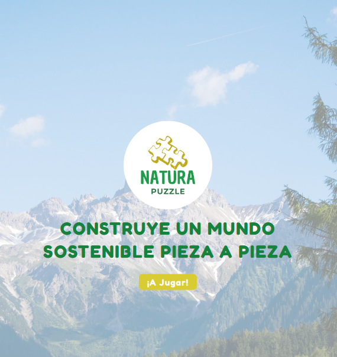
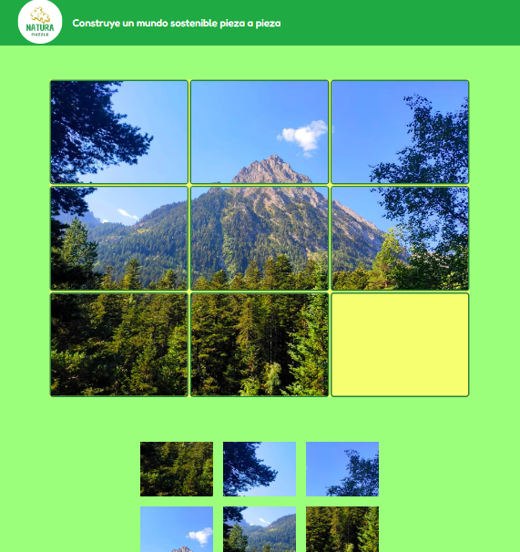

# NATURA PUZZLE🌿🧩

Me gusta fotografiar paisajes. Me emociona contemplar la belleza del mundo natural y lo que puede llegar a transmitir. Desde sensaciones y emociones como la libertad y la serenidad, hasta conceptos sociales y políticos, como la denuncia de la acción humana en el entorno. Este sentir me lleva a crear y presentar NATURA PUZZLE. ¡Bienvenid@s! Este proyecto une la belleza de los paisajes con el aprendizaje sobre la naturaleza y el desarrollo sostenible, en su inicio dirigido a niñ@s entre 8 y 12 años.

En un mundo lleno de desinformación, es importante proporcionar información precisa y educativa sobre temas como el cambio climático y la importancia de cuidar nuestro planeta. ¡Diviértete aprendiendo!

## Funcionalidades 🎮

La usuaria puede disfrutar de un puzzle interactivo con fotografías relacionadas con la naturaleza.

- Puede seleccionar y mover las piezas del puzzle haciendo clic en ellas.
- Se descubre un mensaje educativo sobre la naturaleza y el mundo sostenible al completar el puzzle.
  La aplicación cuenta con una interfaz amigable y atractiva para l@s más pequeñ@s.

## ¿Cómo continúa la historia?

Mi objetivo es hacer crecer la idea. Tener variedad de puzzles con diferentes temas (agua, bosques, ganadería y agricultura ...)

## Tecnologías Utilizadas 🚀

- React
- React Router
- Hooks para las peticiones al servidor
- Uso de props para pasar datos a componentes hijos
- Uso de eventos en React para atender a interacciones de la usuaria
- Utilización de métodos funcionales de array (map, filter, etc.)
- Validación de props utilizando defaultProps y propTypes
- HTML
- CSS
- JavaScript

## Contribución 💡

¡Las contribuciones son bienvenidas!

¡Diviértete jugando y aprendiendo sobre la naturaleza! 🌍🌱
