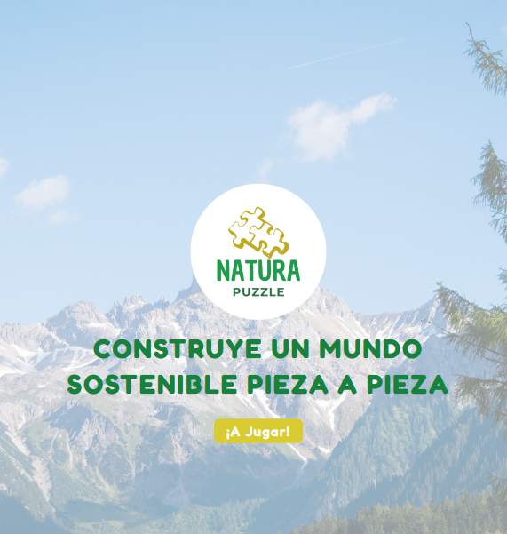
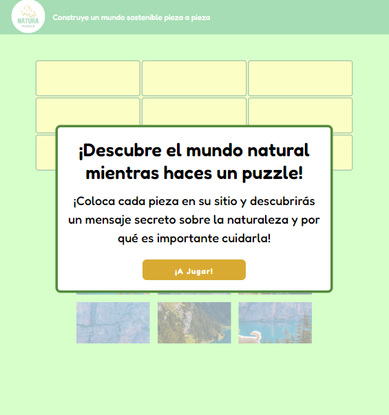

# NATURA PUZZLE🌿🧩

¡Bienvenid@s a NATURA PUZZLE! Este proyecto tiene como objetivo acercar el aprendizaje sobre la naturaleza y el desarrollo sostenible, en su inicio dirigido a niñ@s. En un mundo lleno de desinformación, es importante proporcionar información precisa y educativa sobre temas como el cambio climático y la importancia de cuidar nuestro planeta.

## Funcionalidades 🎮

- La usuaria puede disfrutar de un puzzle interactivo con imágenes relacionadas con la naturaleza.
- Puedes seleccionar y mover las piezas del puzzle.
- Se descubre un mensaje educativo sobre la naturaleza al completar el puzzle.
- La aplicación cuenta con una interfaz amigable y atractiva para l@s más pequeñ@s.

## Tecnologías Utilizadas 🚀

- React
- React Router
- Hooks para las peticiones al servidor
- Uso de props para pasar datos a componentes hijos
- Uso de eventos en React para atender a interacciones de la usuaria
- Utilización de métodos funcionales de array (map, filter, etc.)
- Validación de props utilizando defaultProps y propTypes
- HTML
- CSS
- JavaScript

## Contribución 💡

¡Las contribuciones son bienvenidas!

¡Diviértete jugando y aprendiendo sobre la naturaleza! 🌍🌱
